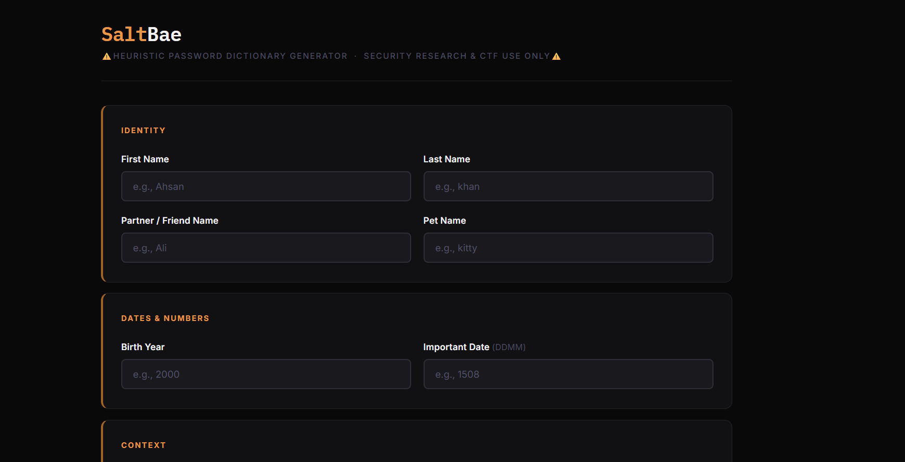

# SaltBae 🧂 | Heuristic Password Dictionary Generator


SaltBae is a localized, privacy-first cybersecurity utility designed to generate highly targeted password dictionaries based on personal and contextual heuristics. It simulates how an attacker might build a probability-based cracking list without creating billions of useless combinations.

## 📸 Screenshots




## 🎯 Why is this useful for Password List Generation?
Standard, massive wordlists (like `rockyou.txt`) are great for broad attacks, but they often fail during **targeted risk assessments** or specific CTF scenarios where a user's personal context is key. 

When people create passwords, they rarely use pure randomness. Instead, they rely on predictable patterns—combining their pet's name with a birth year, or their hometown with a special character. 

**SaltBae solves this by:**
1. Taking targeted OSINT data (names, hobbies, important dates, companies).
2. Applying intelligent permutations (e.g., `Word + Symbol + Number`) instead of blind brute-force generation.
3. Outputting a highly probable, concise `.txt` wordlist that is optimized for tools like **Hashcat** or **Hydra**, drastically reducing cracking time during audits.

## 📝 Sample Output

To understand how the heuristic engine works, here is an example of what it generates based on minimal inputs:

**Target Inputs:**
* **First Name:** `Admin`
* **Birth Year:** `1999`
* **Hobby:** `Cyber`
* **Custom Keyword:** `!`

**Sample of Generated Dictionary (Heuristic Engine):**
```text
Admin1999
admin@1999
Admin!
Cyber1999
cyber_admin
rebyC1999      # (Reversed string mutation)
@dmin!         # (Leetspeak mutation)
Admin123       # (Common suffix appended)
